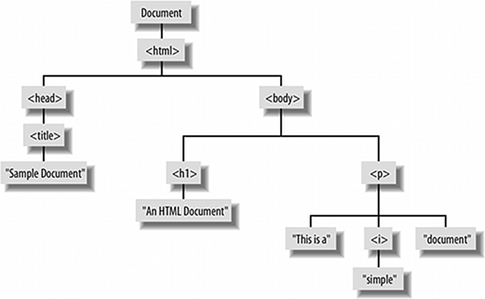
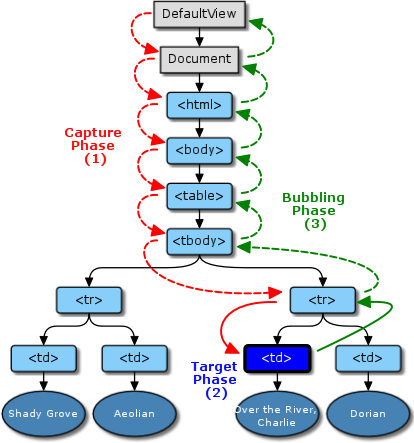

!SLIDE subsection
# The Document Object Model #

!SLIDE bullets
# DOM #
* one of the reasons JS is hated
* browser as host-environment

!SLIDE bullets
# DOM features #
* window object as global object
* client-side object hierarchy
* event-driven programming

!SLIDE bullets
# Embedding scripts in HTML #
* \
	[…]
	

!SLIDE small
# external files #

	@@@ html
	

!SLIDE
# \<noscript> tag #

	@@@ html
	<noscript>
		<h1>JavaScript has to be activated.</h1>
	</noscript>

!SLIDE
# Scripts can only access and manipulate document elements that appear before the script. #

!SLIDE subsection
# \<DISCLAIMER> #
## cross-browser issues ##

!SLIDE subsection
# window object #

!SLIDE execute
# Browser location #

	@@@ javaScript
	result = window.location.href

	// window.location.protocol
	// window.location.hostname
	// window.location.port
	// window.location.pathname
	// …

!SLIDE small
# Changing location #

	@@@ javaScript
	window.location = "http://rascals.example.com";

!SLIDE execute
# Timers #

	@@@ javaScript
	setTimeout(function () {
		alert("Hello World!");
	}, 1000);

!SLIDE execute
# Dialog boxes #
## alert, confirm, prompt ##
### *(bad usability)* ###

	@@@ javaScript
	result = confirm("Go on?");

!SLIDE subsection
# Document tree #

!SLIDE

	@@@ html
	<html>
		<head>
			<title>Sample Document</title>
		</head>
		<body>
			<h1>An HTML Document</h1>
			

				This is a <i>simple</i> document.
			

		</body>
	</html>

!SLIDE center

 
*from: Flanagan, D. 2006 Javascript: the Definitive Guide. 5th. O'Reilly & Associates, Inc.*

!SLIDE small
# Finding elements #

	@@@ javaScript
	// document == window.document
	var paras = document.getElementsByTagName("p");
	var content = document.getElementById("content");
	paras[0].getElementsByTagName("i");

!SLIDE smbullets
# Traversing a document #

	@@@ javaScript
	// array containing nodes not elements
	node.childNodes

	node.firstChild, node.lastChild

	node.nextSibling, node.previousSibling

	node.parentNode

!SLIDE bullets
# Modifying an element #
## \<textarea> tags' properties

* value
* id
* className *(not class!)*
* title

!SLIDE
# Modifying an element #

	@@@ javaScript
	var old_content = my_textarea.value;
	my_textarea.value = "lorem ipsum";

!SLIDE
# Manipulating style #
## *node*.className ##
## *node*.style.*stylename* ##

	@@@ javaScript
	my_textarea.style.fontSize = "24px";

!SLIDE bullets
# Making elements #
* my_button = document.createElement("button")
* my_text = document.createTextNode("lorem ipsum")
* **But:** new nodes not yet in the document

!SLIDE bullets
# Inserting elements #
* *node*.appendChild(*new*)
* *node*.insertBefore(*new*, *sibling*)

!SLIDE bullets
# Removing elements #
* *parent*.removeChild(*child*)
* *node*.parentNode.removeChild(*node*)

!SLIDE bullets
# innerHTML property #
* not official part of the DOM
* yet supported by all modern browsers
* very powerful!

!SLIDE code
# innerHTML property #
	@@@ javaScript
	table.innerHTML = "<tr><th>Name</th>"+
	                  "<th>Type</th>"+
	                  "<th>Value</th></tr>";

!SLIDE subsection
# Events #

!SLIDE bullets
# Events #
* event-driven, single-threaded programming model
* events originating from nodes
* invocation of event handler functions

!SLIDE smbullets
# Mouse events #
* click/dblclick
* mousedown/mouseup
* mouseover/mouseout
* mousemove

!SLIDE smbullets
# Form/Input events #
* focus/blur
* change
* keydown/keypress/keyup
* reset/submit

!SLIDE smbullets
# Window events #
* load
* unload

!SLIDE
# Attaching event handler #
## *(W3C style)* ##

	@@@ javaScript
	var handler = function (event) {
		var my_img = event.target;
		alert("user clicked on " + my_img.src);
	};

	my_img.addEventListener("click", handler, false);

!SLIDE small
# load event #
	@@@ javaScript
	window.addEventListener("load", function (event) {
		alert("Just loaded");
	}, false);

!SLIDE center
# Event propagation #

 
*from: http://dev.w3.org/2006/webapi/DOM-Level-3-Events/html/DOM3-Events.html*

!SLIDE bullets
# Event propagation #
* capturing phase (last parameter of #addEventListener)
* target phase (event.preventDefault())
* bubbling phase (event.stopPropagation())

!SLIDE
# The value of *this* in an event handler refers to the object on which the handler was registered. #

!SLIDE subsection
# \</DISCLAIMER> #
## cross-browser issues ##

