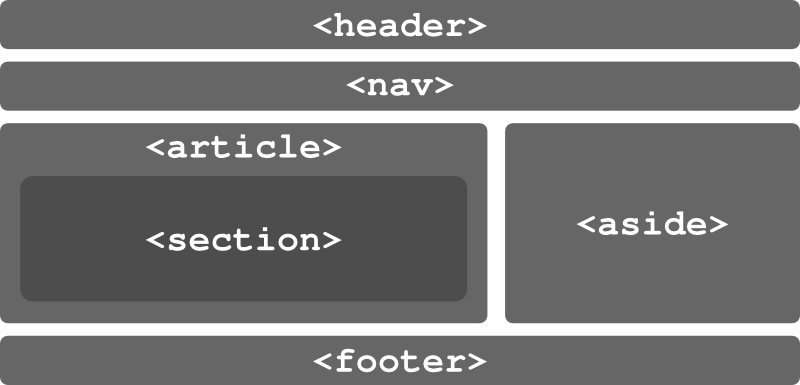

!SLIDE
# Neue semantische Elemente #

!SLIDE
    <section>
### thematische Gruppierung von Inhalt typischerweise mit Überschrift: Kapitel, tabbed pages ###
!SLIDE
    <nav>
### Navigationslinks ###
!SLIDE
    <article>
### eigenständige Komponente in einer Seite, die auch unabhängig vom Rest verbreited werden kann (Newsfeeds…): Forumsbeitrag, Zeitungsartikel, Blogeintrag, Kommentar
!SLIDE
    <aside>
### Teil einer Seite, der nur geringen Bezug zum Rest der Seite hat. In gedruckten Werken häufig als Seitenleiste abgesetzt.
!SLIDE
    <hgroup>
### Gruppierung von mehreren Überschriften (&lt;h1>-&lt;h6>)
!SLIDE
    <header>
### enthält Sachen wie Überschrift einer &lt;section>, Einleitungen, Navigationshilfen, Suchformulare, Logos
!SLIDE
    <footer>
### enthält Autor einer &lt;section>, Links, Copyright usw.
!SLIDE
    <time>
### repräsentiert eine Zeitangabe
!SLIDE
    <mark>
### ein Stück Text, mit Textmarker angestrichen

!SLIDE center

!SLIDE smaller
# Internet Explorer Blues #

    @@@ HTML
    
    
    

      Far far away, behind the
      <mark>word mountains</mark>
    

