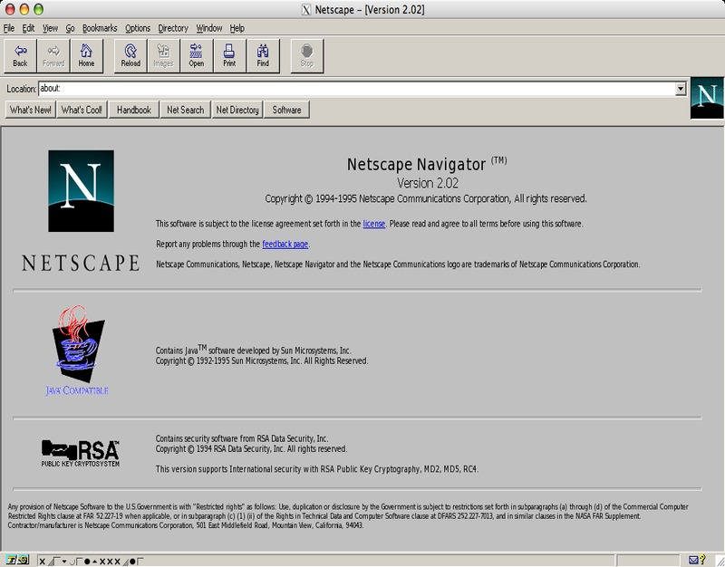
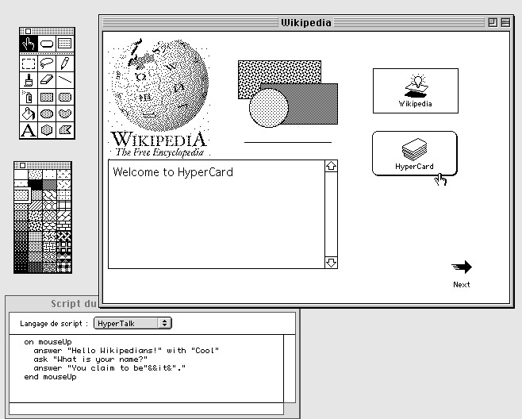

!SLIDE subsection
# History #

!SLIDE
# 1995 #

!SLIDE center

!SLIDE
## Request → Response →  Request → … ? ##
# Interactivity! #

!SLIDE
# Java? #

!SLIDE center

!SLIDE smbullets
## HyperCard ##
* stack of virtual cards
* cards contain "forms"
* *buttons, text fields …*
* HyperTalk
* *put 15 into total*

!SLIDE center

<!--
In order to do that, they hired this guy, Brendan Eich, who had been at Silicon Graphics. Brilliant guy. In his interview he said he wanted to write a Scheme interpreter, and they said ‘that’s great, that’s just what we want’. After they hired him they found out what Scheme was, and they said ‘no, no, no, you can’t do that. People won’t like that. Do something that looks more like Visual BASIC, or Java, something people like.’

So he did that. He combined elements of three languages: Java, because he was told he had to, and two really interesting languages, two failed languages in the sense that they got zero market acceptance, but two brilliant languages and two highly influential languages.
-->

!SLIDE bullets
* Syntax: C, Java
* Design Principles: Self, Scheme

!SLIDE
## JS, unlike Python, was a rushed little hack for Netscape 2 that was then frozen prematurely during the browser wars, and evolved significantly only once by ECMA.
* http://weblogs.mozillazine.org/roadmap/archives/2006/02/js_and_python_news.html

!SLIDE smbullets incremental
* LiveScript
* JavaScript (1995)
* JScript (1996)
* ECMAScript (1997)
* ECMAScript 3rd (1998)
* ECMAScript 5th (2009)

