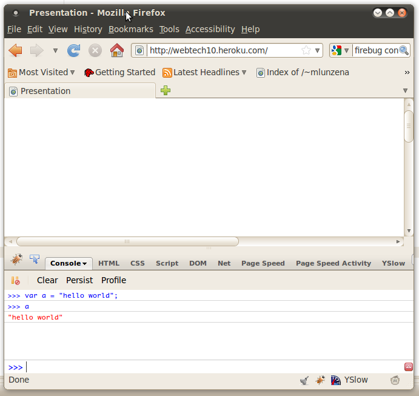

!SLIDE subsection
# Why should I use JavaScript?

!SLIDE bullets
# No choice! #
* The web is too important.
* JS is in every browser.
* Java applets failed.

!SLIDE bullets
# JavaScript is *really* good! #
* lightweight + expressive
* functional programming is fun!

!SLIDE center

!SLIDE
# JavaScript Online REPL #
### *read-eval-print loop* ###

##http://www.squarefree.com/shell/shell.html##
